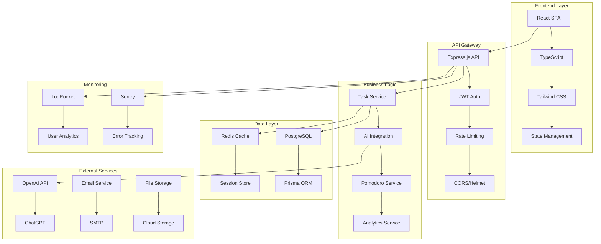
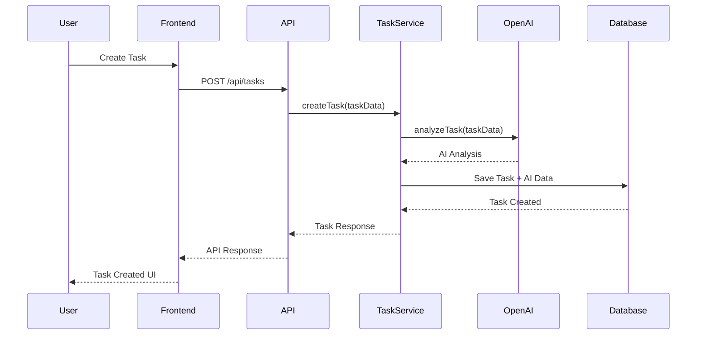
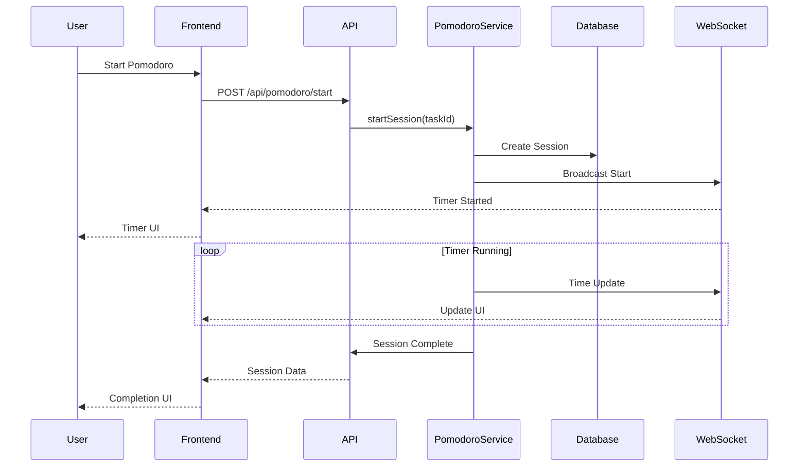
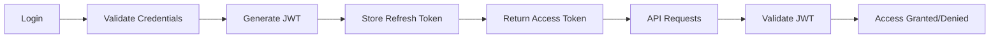
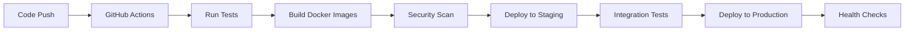

# 🏗️ Arquitetura do Sistema - Focus Todo Turbinado

## 🎯 Visão Geral da Arquitetura

O Focus Todo Turbinado segue uma arquitetura moderna baseada em microserviços, com separação clara entre frontend, backend e serviços externos, garantindo escalabilidade, manutenibilidade e performance.

## 📐 Diagrama de Arquitetura



## 🏢 Padrão Arquitetural

### 1. **Clean Architecture**
```
┌─────────────────────────────────────┐
│           Presentation Layer        │
│  (React Components, API Routes)     │
├─────────────────────────────────────┤
│           Business Logic            │
│  (Services, Use Cases, Domain)      │
├─────────────────────────────────────┤
│           Data Access Layer         │
│  (Repositories, Database)           │
└─────────────────────────────────────┘
```

### 2. **Domain-Driven Design (DDD)**
- **Entities**: User, Task, PomodoroSession
- **Value Objects**: Priority, Status, TimeEstimate
- **Services**: TaskAnalysisService, ProductivityService
- **Repositories**: UserRepository, TaskRepository

## 🔧 Componentes do Sistema

### Frontend Architecture
```typescript
// Estrutura de pastas
src/
├── components/          # Componentes reutilizáveis
│   ├── ui/             # Componentes base (Button, Input, etc.)
│   ├── forms/          # Formulários específicos
│   └── layout/         # Componentes de layout
├── pages/              # Páginas da aplicação
├── hooks/              # Custom hooks
├── services/           # Serviços de API
├── stores/             # Gerenciamento de estado
├── types/              # Definições TypeScript
└── utils/              # Utilitários
```

### Backend Architecture
```typescript
// Estrutura de pastas
src/
├── controllers/        # Controladores de API
├── services/           # Lógica de negócio
├── repositories/       # Acesso a dados
├── middleware/         # Middlewares customizados
├── models/             # Modelos de dados
├── routes/             # Definição de rotas
├── utils/              # Utilitários
└── config/             # Configurações
```

## 🔄 Fluxo de Dados

### 1. Criação de Tarefa com IA


### 2. Sessão Pomodoro


## 🗄️ Modelo de Dados

### Entidades Principais
```typescript
// User Entity
interface User {
  id: string;
  email: string;
  name: string;
  avatarUrl?: string;
  preferences: UserPreferences;
  createdAt: Date;
  updatedAt: Date;
}

// Task Entity
interface Task {
  id: string;
  userId: string;
  title: string;
  description?: string;
  status: TaskStatus;
  priority: Priority;
  category?: string;
  dueDate?: Date;
  estimatedTime?: number;
  aiAnalysis?: AIAnalysis;
  createdAt: Date;
  updatedAt: Date;
}

// PomodoroSession Entity
interface PomodoroSession {
  id: string;
  userId: string;
  taskId?: string;
  duration: number;
  completed: boolean;
  startedAt: Date;
  endedAt?: Date;
}

// AIAnalysis Value Object
interface AIAnalysis {
  suggestedPriority: Priority;
  estimatedTime: number;
  optimizationSuggestions: string[];
  category: string;
  confidence: number;
}
```

## 🔌 Integrações Externas

### OpenAI API Integration
```typescript
// Service Layer
class OpenAIService {
  async analyzeTask(taskData: TaskData): Promise<AIAnalysis> {
    const prompt = this.buildTaskAnalysisPrompt(taskData);
    const response = await this.openai.chat.completions.create({
      model: 'gpt-4',
      messages: [{ role: 'user', content: prompt }],
      temperature: 0.7,
      max_tokens: 1000
    });
    
    return this.parseAIResponse(response);
  }
  
  async analyzeProductivity(userData: ProductivityData): Promise<ProductivityInsights> {
    // Implementation for productivity analysis
  }
}
```

### WebSocket Integration
```typescript
// Real-time Features
class WebSocketService {
  private io: Server;
  
  constructor(server: Server) {
    this.io = new Server(server, {
      cors: { origin: process.env.FRONTEND_URL }
    });
    
    this.setupEventHandlers();
  }
  
  private setupEventHandlers() {
    this.io.on('connection', (socket) => {
      socket.on('join-user-room', (userId: string) => {
        socket.join(`user-${userId}`);
      });
      
      socket.on('pomodoro-update', (data) => {
        this.broadcastToUser(data.userId, 'pomodoro-update', data);
      });
    });
  }
}
```

## 🔒 Segurança e Autenticação

### JWT Authentication Flow


### Security Middleware Stack
```typescript
// Middleware Configuration
app.use(helmet());                    // Security headers
app.use(cors(corsOptions));          // CORS configuration
app.use(rateLimit(rateLimitConfig)); // Rate limiting
app.use(express.json({ limit: '10mb' })); // Body parsing
app.use(validateRequest);            // Input validation
app.use(authenticateJWT);            // JWT authentication
```

## 📊 Performance e Escalabilidade

### Caching Strategy
```typescript
// Redis Cache Implementation
class CacheService {
  async get<T>(key: string): Promise<T | null> {
    const cached = await this.redis.get(key);
    return cached ? JSON.parse(cached) : null;
  }
  
  async set(key: string, value: any, ttl: number = 3600): Promise<void> {
    await this.redis.setex(key, ttl, JSON.stringify(value));
  }
  
  async invalidate(pattern: string): Promise<void> {
    const keys = await this.redis.keys(pattern);
    if (keys.length > 0) {
      await this.redis.del(...keys);
    }
  }
}
```

### Database Optimization
```sql
-- Connection Pool Configuration
CREATE POOL task_pool (
  min_connections = 5,
  max_connections = 20,
  connection_timeout = 30,
  idle_timeout = 300
);

-- Query Optimization
EXPLAIN ANALYZE SELECT 
  t.*, 
  u.name as user_name,
  COUNT(ps.id) as pomodoro_sessions
FROM tasks t
JOIN users u ON t.user_id = u.id
LEFT JOIN pomodoro_sessions ps ON t.id = ps.task_id
WHERE t.user_id = $1 AND t.status = 'pending'
GROUP BY t.id, u.name
ORDER BY t.priority DESC, t.due_date ASC;
```

## 🧪 Estratégia de Testes

### Test Pyramid
```
        /\
       /  \     E2E Tests (Playwright)
      /____\    
     /      \   Integration Tests (Jest)
    /________\  
   /          \ Unit Tests (Jest)
  /____________\
```

### Testing Architecture
```typescript
// Test Configuration
const testConfig = {
  unit: {
    coverage: {
      statements: 80,
      branches: 80,
      functions: 80,
      lines: 80
    },
    setupFiles: ['<rootDir>/tests/setup.ts']
  },
  integration: {
    database: 'test_db',
    cleanup: 'afterEach',
    fixtures: './tests/fixtures'
  },
  e2e: {
    browser: ['chromium', 'firefox', 'webkit'],
    trace: 'on-first-retry',
    screenshot: 'only-on-failure'
  }
}
```

## 🚀 Deploy e Infraestrutura

### Container Architecture
```yaml
# docker-compose.yml
version: '3.8'
services:
  frontend:
    build: ./frontend
    ports:
      - "3000:3000"
    environment:
      - REACT_APP_API_URL=http://localhost:4000
    depends_on:
      - backend
  
  backend:
    build: ./backend
    ports:
      - "4000:4000"
    environment:
      - DATABASE_URL=postgresql://user:pass@db:5432/focus_todo
      - REDIS_URL=redis://redis:6379
      - OPENAI_API_KEY=${OPENAI_API_KEY}
    depends_on:
      - db
      - redis
  
  db:
    image: postgres:14
    environment:
      - POSTGRES_DB=focus_todo
      - POSTGRES_USER=user
      - POSTGRES_PASSWORD=pass
    volumes:
      - postgres_data:/var/lib/postgresql/data
  
  redis:
    image: redis:7-alpine
    volumes:
      - redis_data:/data
```

### CI/CD Pipeline


## 📈 Monitoramento e Observabilidade

### Metrics Dashboard
```typescript
// Prometheus Metrics
const metrics = {
  http_requests_total: new Counter({
    name: 'http_requests_total',
    help: 'Total number of HTTP requests',
    labelNames: ['method', 'route', 'status']
  }),
  
  http_request_duration: new Histogram({
    name: 'http_request_duration_seconds',
    help: 'HTTP request duration in seconds',
    labelNames: ['method', 'route']
  }),
  
  openai_api_calls: new Counter({
    name: 'openai_api_calls_total',
    help: 'Total number of OpenAI API calls',
    labelNames: ['model', 'status']
  })
};
```

### Logging Strategy
```typescript
// Structured Logging
const logger = winston.createLogger({
  level: process.env.LOG_LEVEL || 'info',
  format: winston.format.combine(
    winston.format.timestamp(),
    winston.format.errors({ stack: true }),
    winston.format.json()
  ),
  defaultMeta: { service: 'focus-todo-api' },
  transports: [
    new winston.transports.Console(),
    new winston.transports.File({ filename: 'logs/error.log', level: 'error' }),
    new winston.transports.File({ filename: 'logs/combined.log' })
  ]
});
```

## 🔄 Versionamento e Releases

### API Versioning Strategy
```typescript
// API Versioning
app.use('/api/v1', v1Routes);
app.use('/api/v2', v2Routes);

// Deprecation Strategy
app.use('/api/v1', (req, res, next) => {
  res.set('Deprecation', 'true');
  res.set('Sunset', '2024-12-31');
  next();
});
```

### Database Migration Strategy
```typescript
// Prisma Migration Workflow
const migrationWorkflow = {
  development: {
    autoMigrate: true,
    seedOnMigrate: true
  },
  staging: {
    autoMigrate: false,
    manualApproval: true,
    backupBeforeMigrate: true
  },
  production: {
    autoMigrate: false,
    manualApproval: true,
    backupBeforeMigrate: true,
    rollbackPlan: true
  }
};
```

## 🎯 Próximos Passos

1. **Implementação do MVP**: Foco nas funcionalidades core
2. **Testes Automatizados**: Cobertura completa de testes
3. **Monitoramento**: Implementação de métricas e alertas
4. **Otimização**: Performance e escalabilidade
5. **Features Avançadas**: IA avançada e analytics 