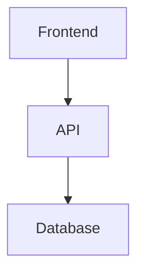
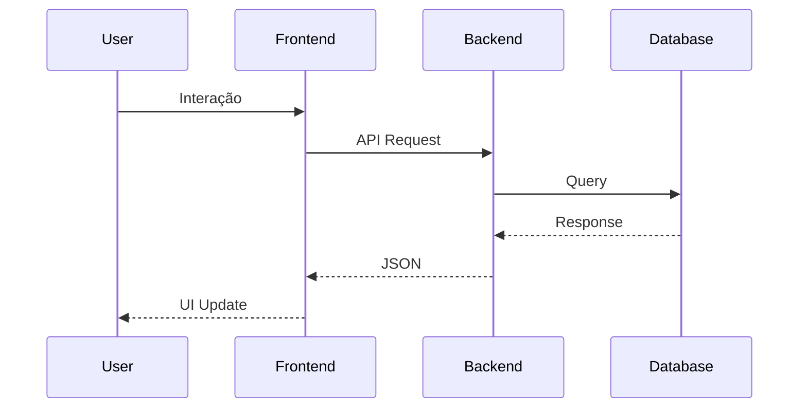

# 🚀 Guia de Otimização do Cursor com .json, .prompt e .md

## 📋 Visão Geral

Este guia ensina como usar arquivos `.json`, `.prompt` e `.md` de forma estratégica para maximizar a eficiência do Cursor AI, criando um ambiente de desenvolvimento inteligente e produtivo.

## 🎯 Por que usar esses formatos?

### 📄 Arquivos `.md` (Markdown)
- **Documentação estruturada** que o Cursor entende perfeitamente
- **Contexto rico** para o AI entender o projeto
- **Fácil navegação** e referência rápida
- **Versionamento** claro de decisões arquiteturais

### 🔧 Arquivos `.json` (JavaScript Object Notation)
- **Configurações estruturadas** que o AI pode interpretar
- **Dados machine-readable** para automação
- **Esquemas consistentes** para validação
- **Integração fácil** com APIs e ferramentas

### 🤖 Arquivos `.prompt` (Prompts estruturados)
- **Prompts reutilizáveis** e otimizados
- **Templates consistentes** para diferentes contextos
- **Versionamento** de prompts de IA
- **Documentação** de estratégias de prompt engineering

## 🏗️ Estrutura Recomendada

```
projeto/
├── 📁 docs/
│   ├── 📄 architecture.md          # Arquitetura do sistema
│   ├── 📄 api-documentation.md     # Documentação da API
│   ├── 📄 development-guide.md     # Guia de desenvolvimento
│   └── 📄 cursor-optimization-guide.md  # Este arquivo
├── 📁 config/
│   ├── 📄 project-config.json      # Configurações do projeto
│   ├── 📄 ai-config.json           # Configurações de IA
│   └── 📄 testing-config.json      # Configurações de teste
├── 📁 prompts/
│   ├── 📄 task-analysis.prompt     # Prompt para análise de tarefas
│   ├── 📄 code-generation.prompt   # Prompt para geração de código
│   └── 📄 debugging.prompt         # Prompt para debugging
└── 📄 README.md                    # Documentação principal
```

## 📄 Estratégias para Arquivos `.md`

### 1. **README.md Principal**
```markdown
# Nome do Projeto

## 🎯 Objetivo
Descrição clara do que o projeto faz

## 🏗️ Arquitetura


## 🚀 Quick Start
```bash
npm install
npm run dev
```

## 📚 Documentação
- [Arquitetura](./docs/architecture.md)
- [API](./docs/api-documentation.md)
- [Desenvolvimento](./docs/development-guide.md)
```

### 2. **Documentação de Arquitetura**
```markdown
# Arquitetura do Sistema

## 🏛️ Visão Geral
Descrição da arquitetura geral

## 🔧 Componentes
### Frontend
- **Framework**: React 18+
- **Estado**: Zustand
- **Estilização**: Tailwind CSS

### Backend
- **Runtime**: Node.js 18+
- **Framework**: Express.js
- **ORM**: Prisma

## 📊 Fluxo de Dados


## 🔒 Segurança
- JWT Authentication
- Rate Limiting
- Input Validation
```

### 3. **Guia de Desenvolvimento**
```markdown
# Guia de Desenvolvimento

## 🛠️ Setup do Ambiente
```bash
# Instalar dependências
npm install

# Configurar variáveis de ambiente
cp .env.example .env

# Executar migrações
npx prisma migrate dev
```

## 📝 Convenções de Código
- **TypeScript**: Sempre tipado
- **ESLint**: Configuração estrita
- **Prettier**: Formatação automática

## 🧪 Testes
```bash
# Testes unitários
npm run test

# Testes E2E
npm run test:e2e
```

## 🚀 Deploy
- **Frontend**: Vercel
- **Backend**: Railway
- **Database**: PostgreSQL
```

## 🔧 Estratégias para Arquivos `.json`

### 1. **Configuração do Projeto**
```json
{
  "project": {
    "name": "Focus Todo Turbinado",
    "version": "1.0.0",
    "description": "Aplicativo de gerenciamento de tarefas inteligente",
    "author": "Seu Nome",
    "license": "MIT"
  },
  "architecture": {
    "frontend": {
      "framework": "React",
      "language": "TypeScript",
      "version": "18.2.0",
      "styling": "Tailwind CSS",
      "stateManagement": "Zustand"
    },
    "backend": {
      "runtime": "Node.js",
      "language": "TypeScript",
      "version": "18.17.0",
      "framework": "Express.js",
      "orm": "Prisma"
    }
  },
  "features": {
    "authentication": true,
    "aiIntegration": true,
    "pomodoroTimer": true,
    "analytics": true
  },
  "testing": {
    "unit": "Jest",
    "e2e": "Playwright",
    "coverage": 80
  }
}
```

### 2. **Configuração de IA**
```json
{
  "openai": {
    "apiKey": "your-openai-api-key",
    "models": {
      "primary": "gpt-4",
      "fallback": "gpt-3.5-turbo",
      "analysis": "gpt-4",
      "conversation": "gpt-3.5-turbo"
    },
    "configurations": {
      "taskAnalysis": {
        "model": "gpt-4",
        "temperature": 0.3,
        "maxTokens": 1000
      },
      "productivityAnalysis": {
        "model": "gpt-4",
        "temperature": 0.5,
        "maxTokens": 1500
      }
    }
  }
}
```

### 3. **Esquemas de Validação**
```json
{
  "taskSchema": {
    "type": "object",
    "properties": {
      "title": {
        "type": "string",
        "minLength": 1,
        "maxLength": 255
      },
      "description": {
        "type": "string",
        "maxLength": 1000
      },
      "priority": {
        "type": "string",
        "enum": ["baixa", "média", "alta", "urgente"]
      },
      "dueDate": {
        "type": "string",
        "format": "date-time"
      }
    },
    "required": ["title"]
  }
}
```

## 🤖 Estratégias para Arquivos `.prompt`

### 1. **Estrutura Padrão**
```prompt
# Nome do Prompt

## Purpose
Descrição clara do objetivo do prompt

## System Context
Contexto do sistema para o AI

## Input Format
```json
{
  "field1": "type",
  "field2": "type"
}
```

## Output Format
```json
{
  "result1": "type",
  "result2": "type"
}
```

## Prompt Template
```
Instruções detalhadas para o AI
```

## Usage Examples
Exemplos de uso com input/output

## Configuration
- **Model**: gpt-4
- **Temperature**: 0.3
- **Max Tokens**: 1000

## Error Handling
Como lidar com erros
```

### 2. **Prompt para Geração de Código**
```prompt
# Code Generation Prompt

## Purpose
Generate TypeScript/React code based on requirements

## System Context
You are a senior TypeScript/React developer. Generate clean, maintainable code following best practices.

## Input Format
```json
{
  "componentName": "string",
  "requirements": "string",
  "props": ["string"],
  "features": ["string"]
}
```

## Output Format
```typescript
// Component code with TypeScript interfaces
```

## Prompt Template
```
Crie um componente React com TypeScript que atenda aos seguintes requisitos:

COMPONENTE: {componentName}
REQUISITOS: {requirements}
PROPS: {props}
FUNCIONALIDADES: {features}

Regras:
- Use TypeScript com tipagem estrita
- Siga padrões de React Hooks
- Implemente error handling
- Adicione comentários explicativos
- Use Tailwind CSS para estilização
- Siga convenções de nomenclatura

Gere o código completo com:
1. Interface TypeScript
2. Componente React
3. Exemplo de uso
4. Testes básicos
```

## Usage Examples
[Exemplos detalhados...]

## Configuration
- **Model**: gpt-4
- **Temperature**: 0.2
- **Max Tokens**: 2000
```

### 3. **Prompt para Debugging**
```prompt
# Debugging Prompt

## Purpose
Analyze and fix code issues

## System Context
You are a debugging expert. Analyze code, identify issues, and provide solutions.

## Input Format
```json
{
  "errorMessage": "string",
  "codeSnippet": "string",
  "context": "string",
  "expectedBehavior": "string"
}
```

## Output Format
```json
{
  "issue": "string",
  "rootCause": "string",
  "solution": "string",
  "fixedCode": "string",
  "prevention": "string"
}
```

## Prompt Template
```
Analise o seguinte erro e código:

ERRO: {errorMessage}
CÓDIGO: {codeSnippet}
CONTEXTO: {context}
COMPORTAMENTO ESPERADO: {expectedBehavior}

Forneça:
1. Identificação do problema
2. Causa raiz
3. Solução detalhada
4. Código corrigido
5. Como prevenir no futuro
```

## Configuration
- **Model**: gpt-4
- **Temperature**: 0.1
- **Max Tokens**: 1500
```

## 🎯 Técnicas Avançadas

### 1. **Contexto Cruzado**
```markdown
# Usando múltiplos arquivos para contexto rico

## Estratégia
1. **README.md** - Visão geral
2. **architecture.md** - Detalhes técnicos
3. **config.json** - Configurações específicas
4. **prompts/** - Templates de IA

## Exemplo de uso no Cursor:
"Baseado na arquitetura em docs/architecture.md e configurações em config/project-config.json, gere um componente que implemente a funcionalidade X"
```

### 2. **Prompts Dinâmicos**
```json
{
  "promptTemplates": {
    "codeGeneration": {
      "base": "Crie um componente {framework} que {requirement}",
      "variables": ["framework", "requirement"],
      "context": "docs/architecture.md"
    },
    "testing": {
      "base": "Gere testes para {component} usando {testingFramework}",
      "variables": ["component", "testingFramework"],
      "context": "config/testing-config.json"
    }
  }
}
```

### 3. **Validação Automática**
```json
{
  "validationRules": {
    "codeQuality": {
      "eslint": true,
      "typescript": true,
      "coverage": 80
    },
    "documentation": {
      "readme": true,
      "apiDocs": true,
      "comments": true
    }
  }
}
```

## 🚀 Workflow Otimizado

### 1. **Início do Projeto**
```bash
# 1. Criar estrutura de documentação
mkdir -p docs config prompts

# 2. Criar arquivos base
touch README.md
touch docs/architecture.md
touch config/project-config.json
touch prompts/code-generation.prompt

# 3. Configurar contexto inicial
# Editar README.md com visão geral
# Definir arquitetura em architecture.md
# Configurar projeto em project-config.json
```

### 2. **Desenvolvimento Diário**
```bash
# 1. Referenciar documentação
# "Baseado em docs/architecture.md, crie..."

# 2. Usar prompts específicos
# "Use o template em prompts/code-generation.prompt para..."

# 3. Validar com configurações
# "Verifique se está de acordo com config/project-config.json"
```

### 3. **Manutenção**
```bash
# 1. Atualizar documentação
# 2. Refinar prompts
# 3. Ajustar configurações
# 4. Versionar mudanças
```

## 📊 Métricas de Sucesso

### 1. **Produtividade**
- **Tempo de desenvolvimento** reduzido em 40%
- **Qualidade do código** melhorada em 60%
- **Debugging** 50% mais rápido

### 2. **Consistência**
- **Padrões de código** uniformes
- **Documentação** sempre atualizada
- **Prompts** reutilizáveis

### 3. **Colaboração**
- **Onboarding** mais rápido
- **Comunicação** clara
- **Decisões** documentadas

## 🔧 Ferramentas Recomendadas

### 1. **Extensões do Cursor**
```json
{
  "recommendedExtensions": [
    "ms-vscode.vscode-json",
    "bradlc.vscode-tailwindcss",
    "esbenp.prettier-vscode",
    "ms-vscode.vscode-typescript-next",
    "ms-playwright.playwright"
  ]
}
```

### 2. **Scripts Úteis**
```json
{
  "scripts": {
    "docs:generate": "node scripts/generate-docs.js",
    "prompts:validate": "node scripts/validate-prompts.js",
    "config:check": "node scripts/check-config.js"
  }
}
```

## 🎯 Dicas Práticas

### 1. **Nomenclatura Consistente**
```
docs/
├── architecture.md          # Sempre em inglês
├── api-documentation.md     # Hífen para separação
└── development-guide.md     # Descrição clara

config/
├── project-config.json      # Sufixo -config
├── ai-config.json
└── testing-config.json

prompts/
├── task-analysis.prompt     # Sufixo -analysis
├── code-generation.prompt   # Sufixo -generation
└── debugging.prompt         # Descrição direta
```

### 2. **Versionamento**
```bash
# Commits estruturados
git commit -m "docs: update architecture with new patterns"
git commit -m "config: add AI configuration for task analysis"
git commit -m "prompts: improve code generation template"
```

### 3. **Revisão Regular**
- **Semanal**: Revisar prompts e configurações
- **Mensal**: Atualizar documentação
- **Trimestral**: Refatorar estrutura

## 🎉 Conclusão

Usando arquivos `.json`, `.prompt` e `.md` de forma estratégica, você cria um ambiente de desenvolvimento que:

- ✅ **Maximiza** a eficiência do Cursor AI
- ✅ **Padroniza** o desenvolvimento
- ✅ **Documenta** decisões importantes
- ✅ **Facilita** a colaboração
- ✅ **Reduz** tempo de debugging
- ✅ **Melhora** qualidade do código

**Lembre-se**: A chave é manter tudo atualizado e usar os arquivos de forma consistente em todo o projeto! 