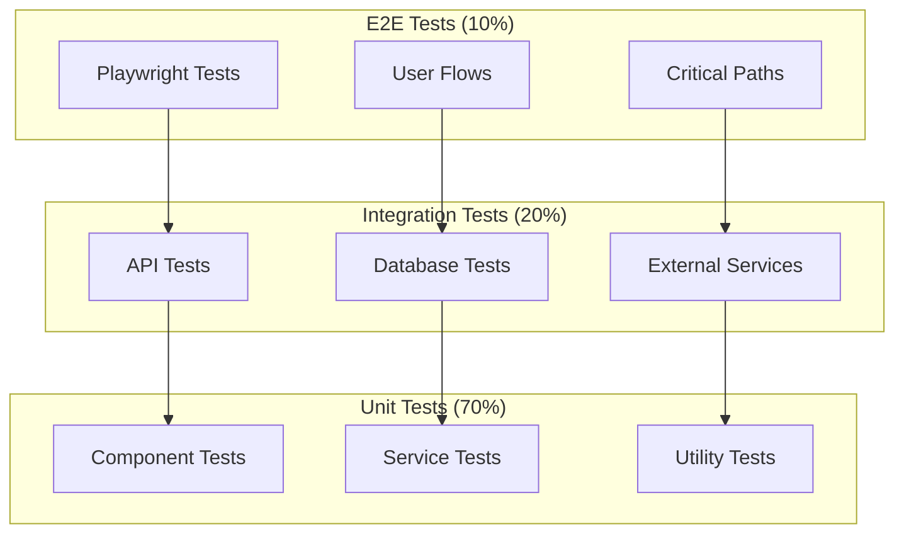

# 🧪 Estratégia de Testes - Focus Todo Turbinado

## 🎯 Visão Geral

Este documento define a estratégia completa de testes para o Focus Todo Turbinado, seguindo as melhores práticas de qualidade de software e garantindo cobertura abrangente de todas as funcionalidades.

## 🏗️ Pirâmide de Testes



## 🔧 Configuração de Testes

### Jest Configuration
```typescript
// jest.config.js
module.exports = {
  preset: 'ts-jest',
  testEnvironment: 'jsdom',
  setupFilesAfterEnv: ['<rootDir>/tests/setup.ts'],
  moduleNameMapping: {
    '^@/(.*)$': '<rootDir>/src/$1',
    '\\.(css|less|scss|sass)$': 'identity-obj-proxy'
  },
  collectCoverageFrom: [
    'src/**/*.{ts,tsx}',
    '!src/**/*.d.ts',
    '!src/main.tsx',
    '!src/vite-env.d.ts'
  ],
  coverageThreshold: {
    global: {
      branches: 80,
      functions: 80,
      lines: 80,
      statements: 80
    }
  },
  testMatch: [
    '<rootDir>/src/**/__tests__/**/*.{ts,tsx}',
    '<rootDir>/src/**/*.{test,spec}.{ts,tsx}'
  ],
  transform: {
    '^.+\\.(ts|tsx)$': 'ts-jest'
  }
};
```

### Playwright Configuration
```typescript
// playwright.config.ts
import { defineConfig, devices } from '@playwright/test';

export default defineConfig({
  testDir: './tests/e2e',
  fullyParallel: true,
  forbidOnly: !!process.env.CI,
  retries: process.env.CI ? 2 : 0,
  workers: process.env.CI ? 1 : undefined,
  reporter: [
    ['html'],
    ['json', { outputFile: 'test-results/results.json' }]
  ],
  use: {
    baseURL: 'http://localhost:3000',
    trace: 'on-first-retry',
    screenshot: 'only-on-failure',
    video: 'retain-on-failure'
  },
  projects: [
    {
      name: 'chromium',
      use: { ...devices['Desktop Chrome'] }
    },
    {
      name: 'firefox',
      use: { ...devices['Desktop Firefox'] }
    },
    {
      name: 'webkit',
      use: { ...devices['Desktop Safari'] }
    },
    {
      name: 'Mobile Chrome',
      use: { ...devices['Pixel 5'] }
    },
    {
      name: 'Mobile Safari',
      use: { ...devices['iPhone 12'] }
    }
  ],
  webServer: {
    command: 'npm run dev',
    url: 'http://localhost:3000',
    reuseExistingServer: !process.env.CI,
    timeout: 120 * 1000
  }
});
```

## 🧪 Testes Unitários

### 1. Component Tests (React)
```typescript
// tests/unit/components/TaskCard.test.tsx
import { render, screen, fireEvent } from '@testing-library/react';
import { TaskCard } from '@/components/TaskCard';
import { Task } from '@/types/task';

const mockTask: Task = {
  id: '1',
  title: 'Test Task',
  description: 'Test Description',
  status: 'pending',
  priority: 'medium',
  userId: 'user1',
  createdAt: new Date(),
  updatedAt: new Date()
};

describe('TaskCard', () => {
  it('renders task information correctly', () => {
    render(<TaskCard task={mockTask} onEdit={jest.fn()} onDelete={jest.fn()} />);
    
    expect(screen.getByText('Test Task')).toBeInTheDocument();
    expect(screen.getByText('Test Description')).toBeInTheDocument();
    expect(screen.getByText('medium')).toBeInTheDocument();
  });

  it('calls onEdit when edit button is clicked', () => {
    const mockOnEdit = jest.fn();
    render(<TaskCard task={mockTask} onEdit={mockOnEdit} onDelete={jest.fn()} />);
    
    fireEvent.click(screen.getByTestId('edit-task-button'));
    expect(mockOnEdit).toHaveBeenCalledWith(mockTask.id);
  });

  it('shows AI analysis when available', () => {
    const taskWithAI = {
      ...mockTask,
      aiAnalysis: {
        suggestedPriority: 'high',
        estimatedTime: 120,
        optimizationSuggestions: ['Break into smaller tasks'],
        confidence: 0.8
      }
    };
    
    render(<TaskCard task={taskWithAI} onEdit={jest.fn()} onDelete={jest.fn()} />);
    
    expect(screen.getByText('AI Analysis')).toBeInTheDocument();
    expect(screen.getByText('Break into smaller tasks')).toBeInTheDocument();
  });
});
```

### 2. Service Tests
```typescript
// tests/unit/services/TaskService.test.ts
import { TaskService } from '@/services/TaskService';
import { OpenAIService } from '@/services/OpenAIService';
import { TaskRepository } from '@/repositories/TaskRepository';

jest.mock('@/services/OpenAIService');
jest.mock('@/repositories/TaskRepository');

describe('TaskService', () => {
  let taskService: TaskService;
  let mockOpenAI: jest.Mocked<OpenAIService>;
  let mockRepository: jest.Mocked<TaskRepository>;

  beforeEach(() => {
    mockOpenAI = new OpenAIService() as jest.Mocked<OpenAIService>;
    mockRepository = new TaskRepository() as jest.Mocked<TaskRepository>;
    taskService = new TaskService(mockRepository, mockOpenAI);
  });

  describe('createTask', () => {
    it('creates task with AI analysis', async () => {
      const taskData = {
        title: 'New Task',
        description: 'Task description',
        userId: 'user1'
      };

      const aiAnalysis = {
        suggestedPriority: 'high',
        estimatedTime: 60,
        optimizationSuggestions: ['Optimize workflow'],
        confidence: 0.9
      };

      mockOpenAI.analyzeTask.mockResolvedValue(aiAnalysis);
      mockRepository.create.mockResolvedValue({
        id: '1',
        ...taskData,
        aiAnalysis,
        status: 'pending',
        priority: 'medium',
        createdAt: new Date(),
        updatedAt: new Date()
      });

      const result = await taskService.createTask(taskData);

      expect(mockOpenAI.analyzeTask).toHaveBeenCalledWith(taskData);
      expect(mockRepository.create).toHaveBeenCalledWith({
        ...taskData,
        aiAnalysis
      });
      expect(result.aiAnalysis).toEqual(aiAnalysis);
    });

    it('handles OpenAI API errors gracefully', async () => {
      const taskData = { title: 'Task', userId: 'user1' };
      
      mockOpenAI.analyzeTask.mockRejectedValue(new Error('API Error'));
      mockRepository.create.mockResolvedValue({
        id: '1',
        ...taskData,
        status: 'pending',
        priority: 'medium',
        createdAt: new Date(),
        updatedAt: new Date()
      });

      const result = await taskService.createTask(taskData);

      expect(result.aiAnalysis).toBeUndefined();
      expect(mockRepository.create).toHaveBeenCalledWith(taskData);
    });
  });

  describe('getTasksByUser', () => {
    it('returns filtered tasks for user', async () => {
      const userId = 'user1';
      const filters = { status: 'pending', priority: 'high' };
      
      const mockTasks = [
        { id: '1', title: 'Task 1', userId, status: 'pending', priority: 'high' },
        { id: '2', title: 'Task 2', userId, status: 'pending', priority: 'high' }
      ];

      mockRepository.findByUser.mockResolvedValue(mockTasks);

      const result = await taskService.getTasksByUser(userId, filters);

      expect(mockRepository.findByUser).toHaveBeenCalledWith(userId, filters);
      expect(result).toEqual(mockTasks);
    });
  });
});
```

### 3. Hook Tests
```typescript
// tests/unit/hooks/useTask.test.ts
import { renderHook, act } from '@testing-library/react';
import { useTask } from '@/hooks/useTask';
import { TaskService } from '@/services/TaskService';

jest.mock('@/services/TaskService');

describe('useTask', () => {
  let mockTaskService: jest.Mocked<TaskService>;

  beforeEach(() => {
    mockTaskService = new TaskService() as jest.Mocked<TaskService>;
  });

  it('creates task successfully', async () => {
    const { result } = renderHook(() => useTask());

    const taskData = { title: 'New Task', userId: 'user1' };
    const createdTask = { id: '1', ...taskData, status: 'pending' };

    mockTaskService.createTask.mockResolvedValue(createdTask);

    await act(async () => {
      await result.current.createTask(taskData);
    });

    expect(mockTaskService.createTask).toHaveBeenCalledWith(taskData);
    expect(result.current.tasks).toContain(createdTask);
  });

  it('handles task creation errors', async () => {
    const { result } = renderHook(() => useTask());

    mockTaskService.createTask.mockRejectedValue(new Error('Creation failed'));

    await act(async () => {
      await result.current.createTask({ title: 'Task', userId: 'user1' });
    });

    expect(result.current.error).toBe('Creation failed');
    expect(result.current.loading).toBe(false);
  });
});
```

## 🔗 Testes de Integração

### 1. API Tests
```typescript
// tests/integration/api/tasks.test.ts
import request from 'supertest';
import { app } from '@/app';
import { PrismaClient } from '@prisma/client';
import { generateJWT } from '@/utils/auth';

const prisma = new PrismaClient();

describe('Tasks API', () => {
  let authToken: string;
  let testUser: any;

  beforeAll(async () => {
    // Setup test database
    await prisma.$connect();
    
    // Create test user
    testUser = await prisma.user.create({
      data: {
        email: 'test@example.com',
        password: 'hashedPassword',
        name: 'Test User'
      }
    });

    authToken = generateJWT(testUser.id);
  });

  afterAll(async () => {
    await prisma.user.delete({ where: { id: testUser.id } });
    await prisma.$disconnect();
  });

  beforeEach(async () => {
    await prisma.task.deleteMany({ where: { userId: testUser.id } });
  });

  describe('POST /api/tasks', () => {
    it('creates task with AI analysis', async () => {
      const taskData = {
        title: 'Integration Test Task',
        description: 'Test description',
        category: 'work'
      };

      const response = await request(app)
        .post('/api/tasks')
        .set('Authorization', `Bearer ${authToken}`)
        .send(taskData)
        .expect(201);

      expect(response.body).toMatchObject({
        title: taskData.title,
        description: taskData.description,
        userId: testUser.id,
        status: 'pending'
      });

      expect(response.body.aiAnalysis).toBeDefined();
      expect(response.body.aiAnalysis.suggestedPriority).toBeDefined();
      expect(response.body.aiAnalysis.estimatedTime).toBeDefined();
    });

    it('validates required fields', async () => {
      const response = await request(app)
        .post('/api/tasks')
        .set('Authorization', `Bearer ${authToken}`)
        .send({})
        .expect(400);

      expect(response.body.errors).toContainEqual({
        field: 'title',
        message: 'Title is required'
      });
    });

    it('requires authentication', async () => {
      await request(app)
        .post('/api/tasks')
        .send({ title: 'Task' })
        .expect(401);
    });
  });

  describe('GET /api/tasks', () => {
    it('returns user tasks with filters', async () => {
      // Create test tasks
      await prisma.task.createMany({
        data: [
          {
            title: 'High Priority Task',
            priority: 'high',
            userId: testUser.id,
            status: 'pending'
          },
          {
            title: 'Low Priority Task',
            priority: 'low',
            userId: testUser.id,
            status: 'completed'
          }
        ]
      });

      const response = await request(app)
        .get('/api/tasks?priority=high&status=pending')
        .set('Authorization', `Bearer ${authToken}`)
        .expect(200);

      expect(response.body).toHaveLength(1);
      expect(response.body[0].title).toBe('High Priority Task');
    });
  });
});
```

### 2. Database Tests
```typescript
// tests/integration/database/TaskRepository.test.ts
import { PrismaClient } from '@prisma/client';
import { TaskRepository } from '@/repositories/TaskRepository';

const prisma = new PrismaClient();
const taskRepository = new TaskRepository(prisma);

describe('TaskRepository', () => {
  let testUser: any;

  beforeAll(async () => {
    await prisma.$connect();
    testUser = await prisma.user.create({
      data: {
        email: 'db-test@example.com',
        password: 'hashedPassword',
        name: 'DB Test User'
      }
    });
  });

  afterAll(async () => {
    await prisma.user.delete({ where: { id: testUser.id } });
    await prisma.$disconnect();
  });

  beforeEach(async () => {
    await prisma.task.deleteMany({ where: { userId: testUser.id } });
  });

  describe('create', () => {
    it('creates task with all fields', async () => {
      const taskData = {
        title: 'Database Test Task',
        description: 'Test description',
        priority: 'high',
        category: 'work',
        userId: testUser.id,
        aiAnalysis: {
          suggestedPriority: 'high',
          estimatedTime: 120
        }
      };

      const task = await taskRepository.create(taskData);

      expect(task).toMatchObject({
        title: taskData.title,
        description: taskData.description,
        priority: taskData.priority,
        userId: testUser.id
      });

      expect(task.id).toBeDefined();
      expect(task.createdAt).toBeDefined();
      expect(task.updatedAt).toBeDefined();
    });
  });

  describe('findByUser', () => {
    it('filters tasks correctly', async () => {
      // Create test tasks
      await prisma.task.createMany({
        data: [
          {
            title: 'Pending Task',
            status: 'pending',
            priority: 'high',
            userId: testUser.id
          },
          {
            title: 'Completed Task',
            status: 'completed',
            priority: 'low',
            userId: testUser.id
          }
        ]
      });

      const pendingTasks = await taskRepository.findByUser(testUser.id, {
        status: 'pending'
      });

      expect(pendingTasks).toHaveLength(1);
      expect(pendingTasks[0].title).toBe('Pending Task');
    });
  });
});
```

## 🌐 Testes E2E (Playwright)

### 1. User Flow Tests
```typescript
// tests/e2e/user-flows/task-management.spec.ts
import { test, expect } from '@playwright/test';

test.describe('Task Management Flow', () => {
  test.beforeEach(async ({ page }) => {
    await page.goto('/');
    await page.fill('[data-testid="email-input"]', 'test@example.com');
    await page.fill('[data-testid="password-input"]', 'password123');
    await page.click('[data-testid="login-button"]');
    await page.waitForURL('/dashboard');
  });

  test('complete task creation with AI analysis', async ({ page }) => {
    // Navigate to create task
    await page.click('[data-testid="create-task-button"]');
    await page.waitForURL('/tasks/new');

    // Fill task form
    await page.fill('[data-testid="task-title"]', 'E2E Test Task');
    await page.fill('[data-testid="task-description"]', 'This is a test task for E2E testing');
    await page.selectOption('[data-testid="task-category"]', 'work');

    // Enable AI analysis
    await page.click('[data-testid="enable-ai-analysis"]');

    // Submit form
    await page.click('[data-testid="submit-task"]');

    // Wait for AI analysis
    await page.waitForSelector('[data-testid="ai-analysis-loading"]');
    await page.waitForSelector('[data-testid="ai-suggestions"]', { timeout: 10000 });

    // Verify AI suggestions are displayed
    const suggestions = await page.locator('[data-testid="ai-suggestion"]');
    await expect(suggestions.first()).toBeVisible();

    // Accept AI suggestions
    await page.click('[data-testid="accept-ai-suggestions"]');

    // Verify task was created
    await page.waitForURL('/dashboard');
    await expect(page.locator('text=E2E Test Task')).toBeVisible();
  });

  test('pomodoro timer functionality', async ({ page }) => {
    // Create a task first
    await page.click('[data-testid="create-task-button"]');
    await page.fill('[data-testid="task-title"]', 'Pomodoro Test Task');
    await page.click('[data-testid="submit-task"]');
    await page.waitForURL('/dashboard');

    // Start pomodoro for the task
    await page.click('[data-testid="start-pomodoro"]');

    // Verify timer is running
    await expect(page.locator('[data-testid="pomodoro-timer"]')).toBeVisible();
    await expect(page.locator('[data-testid="timer-status"]')).toContainText('Working');

    // Wait for timer to complete (use shorter duration for testing)
    await page.waitForSelector('[data-testid="timer-complete"]', { timeout: 30000 });

    // Verify completion
    await expect(page.locator('[data-testid="session-complete"]')).toBeVisible();
  });

  test('task filtering and search', async ({ page }) => {
    // Create multiple tasks
    const tasks = ['High Priority Task', 'Low Priority Task', 'Work Task'];
    
    for (const taskTitle of tasks) {
      await page.click('[data-testid="create-task-button"]');
      await page.fill('[data-testid="task-title"]', taskTitle);
      await page.click('[data-testid="submit-task"]');
      await page.waitForURL('/dashboard');
    }

    // Test search functionality
    await page.fill('[data-testid="task-search"]', 'High Priority');
    await expect(page.locator('text=High Priority Task')).toBeVisible();
    await expect(page.locator('text=Low Priority Task')).not.toBeVisible();

    // Test priority filter
    await page.click('[data-testid="priority-filter"]');
    await page.click('[data-testid="filter-high"]');
    await expect(page.locator('text=High Priority Task')).toBeVisible();
    await expect(page.locator('text=Low Priority Task')).not.toBeVisible();
  });
});
```

### 2. AI Integration Tests
```typescript
// tests/e2e/ai-integration/ai-analysis.spec.ts
import { test, expect } from '@playwright/test';

test.describe('AI Integration', () => {
  test.beforeEach(async ({ page }) => {
    await page.goto('/');
    await page.fill('[data-testid="email-input"]', 'test@example.com');
    await page.fill('[data-testid="password-input"]', 'password123');
    await page.click('[data-testid="login-button"]');
    await page.waitForURL('/dashboard');
  });

  test('AI analyzes task and provides suggestions', async ({ page }) => {
    await page.click('[data-testid="create-task-button"]');
    
    // Create a complex task
    await page.fill('[data-testid="task-title"]', 'Complete project documentation');
    await page.fill('[data-testid="task-description"]', 
      'Write comprehensive documentation for the new API endpoints, including examples and error handling');
    await page.selectOption('[data-testid="task-category"]', 'work');
    await page.fill('[data-testid="task-due-date"]', '2024-12-31');

    // Enable AI analysis
    await page.click('[data-testid="enable-ai-analysis"]');
    await page.click('[data-testid="submit-task"]');

    // Wait for AI analysis
    await page.waitForSelector('[data-testid="ai-analysis-loading"]');
    await page.waitForSelector('[data-testid="ai-suggestions"]', { timeout: 15000 });

    // Verify AI suggestions
    const prioritySuggestion = await page.locator('[data-testid="ai-priority"]');
    const timeEstimate = await page.locator('[data-testid="ai-time-estimate"]');
    const optimizationTips = await page.locator('[data-testid="ai-optimization-tip"]');

    await expect(prioritySuggestion).toBeVisible();
    await expect(timeEstimate).toBeVisible();
    await expect(optimizationTips.first()).toBeVisible();

    // Verify suggestions are reasonable
    const priority = await prioritySuggestion.textContent();
    expect(['baixa', 'média', 'alta', 'urgente']).toContain(priority?.toLowerCase());

    const time = await timeEstimate.textContent();
    expect(parseInt(time || '0')).toBeGreaterThan(0);
  });

  test('AI productivity insights', async ({ page }) => {
    // Navigate to analytics
    await page.click('[data-testid="analytics-tab"]');
    await page.waitForURL('/analytics');

    // Wait for AI insights to load
    await page.waitForSelector('[data-testid="ai-insights"]', { timeout: 10000 });

    // Verify insights are displayed
    const insights = await page.locator('[data-testid="ai-insight"]');
    await expect(insights.first()).toBeVisible();

    // Check for different types of insights
    const productivityScore = await page.locator('[data-testid="productivity-score"]');
    const recommendations = await page.locator('[data-testid="ai-recommendation"]');

    await expect(productivityScore).toBeVisible();
    await expect(recommendations.first()).toBeVisible();
  });
});
```

## 🎭 Testes de Performance

### 1. Load Testing (Artillery)
```yaml
# tests/performance/load-test.yml
config:
  target: 'http://localhost:4000'
  phases:
    - duration: 60
      arrivalRate: 10
      name: "Warm up"
    - duration: 300
      arrivalRate: 50
      name: "Sustained load"
    - duration: 60
      arrivalRate: 0
      name: "Cool down"
  defaults:
    headers:
      Content-Type: 'application/json'

scenarios:
  - name: "Task CRUD operations"
    weight: 70
    flow:
      - post:
          url: "/api/auth/login"
          json:
            email: "test@example.com"
            password: "password123"
          capture:
            - json: "$.token"
              as: "authToken"
      - get:
          url: "/api/tasks"
          headers:
            Authorization: "Bearer {{ authToken }}"
      - post:
          url: "/api/tasks"
          headers:
            Authorization: "Bearer {{ authToken }}"
          json:
            title: "Load Test Task"
            description: "Task created during load test"
            category: "work"

  - name: "AI Analysis"
    weight: 20
    flow:
      - post:
          url: "/api/auth/login"
          json:
            email: "test@example.com"
            password: "password123"
          capture:
            - json: "$.token"
              as: "authToken"
      - post:
          url: "/api/tasks/analyze"
          headers:
            Authorization: "Bearer {{ authToken }}"
          json:
            title: "AI Analysis Test"
            description: "Testing AI analysis under load"
            category: "work"

  - name: "Pomodoro Sessions"
    weight: 10
    flow:
      - post:
          url: "/api/auth/login"
          json:
            email: "test@example.com"
            password: "password123"
          capture:
            - json: "$.token"
              as: "authToken"
      - post:
          url: "/api/pomodoro/start"
          headers:
            Authorization: "Bearer {{ authToken }}"
          json:
            taskId: "test-task-id"
            duration: 25
```

### 2. Performance Monitoring
```typescript
// tests/performance/performance-monitor.ts
import { chromium } from 'playwright';

export class PerformanceMonitor {
  async measurePageLoad(url: string) {
    const browser = await chromium.launch();
    const page = await browser.newPage();
    
    const startTime = Date.now();
    await page.goto(url);
    const loadTime = Date.now() - startTime;

    const metrics = await page.evaluate(() => {
      const navigation = performance.getEntriesByType('navigation')[0] as PerformanceNavigationTiming;
      return {
        domContentLoaded: navigation.domContentLoadedEventEnd - navigation.domContentLoadedEventStart,
        loadComplete: navigation.loadEventEnd - navigation.loadEventStart,
        firstContentfulPaint: performance.getEntriesByName('first-contentful-paint')[0]?.startTime
      };
    });

    await browser.close();
    
    return {
      totalLoadTime: loadTime,
      ...metrics
    };
  }

  async measureAPIResponseTime(endpoint: string, method: string = 'GET', body?: any) {
    const startTime = Date.now();
    
    const response = await fetch(endpoint, {
      method,
      headers: { 'Content-Type': 'application/json' },
      body: body ? JSON.stringify(body) : undefined
    });
    
    const responseTime = Date.now() - startTime;
    
    return {
      responseTime,
      status: response.status,
      success: response.ok
    };
  }
}
```

## 🔍 Testes de Acessibilidade

### 1. Accessibility Tests
```typescript
// tests/accessibility/a11y.spec.ts
import { test, expect } from '@playwright/test';
import { AxeBuilder } from '@axe-core/playwright';

test.describe('Accessibility', () => {
  test('main page should be accessible', async ({ page }) => {
    await page.goto('/');
    
    const accessibilityScanResults = await new AxeBuilder({ page }).analyze();
    
    expect(accessibilityScanResults.violations).toEqual([]);
  });

  test('task creation form should be accessible', async ({ page }) => {
    await page.goto('/tasks/new');
    
    const accessibilityScanResults = await new AxeBuilder({ page }).analyze();
    
    expect(accessibilityScanResults.violations).toEqual([]);
  });

  test('keyboard navigation works correctly', async ({ page }) => {
    await page.goto('/');
    
    // Test tab navigation
    await page.keyboard.press('Tab');
    await expect(page.locator(':focus')).toHaveAttribute('data-testid', 'email-input');
    
    await page.keyboard.press('Tab');
    await expect(page.locator(':focus')).toHaveAttribute('data-testid', 'password-input');
    
    await page.keyboard.press('Tab');
    await expect(page.locator(':focus')).toHaveAttribute('data-testid', 'login-button');
  });

  test('screen reader compatibility', async ({ page }) => {
    await page.goto('/dashboard');
    
    // Check for proper ARIA labels
    await expect(page.locator('[aria-label="Create new task"]')).toBeVisible();
    await expect(page.locator('[aria-label="Search tasks"]')).toBeVisible();
    
    // Check for proper heading structure
    const headings = await page.locator('h1, h2, h3, h4, h5, h6').all();
    expect(headings.length).toBeGreaterThan(0);
  });
});
```

## 📊 Cobertura de Testes

### Coverage Reports
```typescript
// jest.config.js - Coverage configuration
module.exports = {
  // ... other config
  collectCoverageFrom: [
    'src/**/*.{ts,tsx}',
    '!src/**/*.d.ts',
    '!src/main.tsx',
    '!src/vite-env.d.ts',
    '!src/**/*.stories.{ts,tsx}',
    '!src/**/*.test.{ts,tsx}',
    '!src/**/*.spec.{ts,tsx}'
  ],
  coverageThreshold: {
    global: {
      branches: 80,
      functions: 80,
      lines: 80,
      statements: 80
    },
    './src/components/': {
      branches: 85,
      functions: 85,
      lines: 85,
      statements: 85
    },
    './src/services/': {
      branches: 90,
      functions: 90,
      lines: 90,
      statements: 90
    }
  },
  coverageReporters: ['text', 'lcov', 'html', 'json'],
  coverageDirectory: 'coverage'
};
```

## 🚀 CI/CD Integration

### GitHub Actions Workflow
```yaml
# .github/workflows/test.yml
name: Tests

on:
  push:
    branches: [main, develop]
  pull_request:
    branches: [main]

jobs:
  unit-tests:
    runs-on: ubuntu-latest
    steps:
      - uses: actions/checkout@v3
      - uses: actions/setup-node@v3
        with:
          node-version: '18'
          cache: 'npm'
      
      - run: npm ci
      - run: npm run test:unit
      - run: npm run test:coverage
      
      - name: Upload coverage to Codecov
        uses: codecov/codecov-action@v3
        with:
          file: ./coverage/lcov.info

  integration-tests:
    runs-on: ubuntu-latest
    services:
      postgres:
        image: postgres:14
        env:
          POSTGRES_PASSWORD: postgres
          POSTGRES_DB: test_db
        options: >-
          --health-cmd pg_isready
          --health-interval 10s
          --health-timeout 5s
          --health-retries 5
      
      redis:
        image: redis:7
        options: >-
          --health-cmd "redis-cli ping"
          --health-interval 10s
          --health-timeout 5s
          --health-retries 5
    
    steps:
      - uses: actions/checkout@v3
      - uses: actions/setup-node@v3
        with:
          node-version: '18'
          cache: 'npm'
      
      - run: npm ci
      - run: npm run db:migrate:test
      - run: npm run test:integration

  e2e-tests:
    runs-on: ubuntu-latest
    steps:
      - uses: actions/checkout@v3
      - uses: actions/setup-node@v3
        with:
          node-version: '18'
          cache: 'npm'
      
      - run: npm ci
      - run: npx playwright install --with-deps
      - run: npm run test:e2e
      
      - name: Upload test results
        uses: actions/upload-artifact@v3
        if: always()
        with:
          name: playwright-report
          path: playwright-report/
          retention-days: 30

  performance-tests:
    runs-on: ubuntu-latest
    steps:
      - uses: actions/checkout@v3
      - uses: actions/setup-node@v3
        with:
          node-version: '18'
          cache: 'npm'
      
      - run: npm ci
      - run: npm install -g artillery
      - run: npm run test:performance
```

## 📈 Métricas de Qualidade

### Quality Gates
```typescript
// scripts/quality-gates.ts
interface QualityMetrics {
  testCoverage: number;
  testPassRate: number;
  performanceScore: number;
  accessibilityScore: number;
  securityScore: number;
}

export class QualityGates {
  private readonly thresholds = {
    testCoverage: 80,
    testPassRate: 95,
    performanceScore: 90,
    accessibilityScore: 95,
    securityScore: 100
  };

  async checkQualityGates(): Promise<boolean> {
    const metrics = await this.collectMetrics();
    
    const failures = [];
    
    if (metrics.testCoverage < this.thresholds.testCoverage) {
      failures.push(`Test coverage ${metrics.testCoverage}% below threshold ${this.thresholds.testCoverage}%`);
    }
    
    if (metrics.testPassRate < this.thresholds.testPassRate) {
      failures.push(`Test pass rate ${metrics.testPassRate}% below threshold ${this.thresholds.testPassRate}%`);
    }
    
    if (metrics.performanceScore < this.thresholds.performanceScore) {
      failures.push(`Performance score ${metrics.performanceScore} below threshold ${this.thresholds.performanceScore}`);
    }
    
    if (failures.length > 0) {
      console.error('Quality gates failed:');
      failures.forEach(failure => console.error(`- ${failure}`));
      return false;
    }
    
    console.log('All quality gates passed! ✅');
    return true;
  }

  private async collectMetrics(): Promise<QualityMetrics> {
    // Implementation to collect actual metrics
    return {
      testCoverage: 85,
      testPassRate: 98,
      performanceScore: 92,
      accessibilityScore: 96,
      securityScore: 100
    };
  }
}
```

## 🎯 Próximos Passos

1. **Implementação**: Configurar ambiente de testes
2. **Automação**: Integrar testes no pipeline CI/CD
3. **Monitoramento**: Implementar métricas de qualidade
4. **Otimização**: Refinar testes baseado em feedback
5. **Expansão**: Adicionar testes para novas funcionalidades 